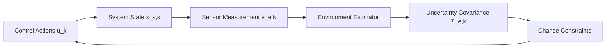

<!-- _class: lead -->

# Perception-Aware Model Predictive Control for Constrained Systems
## Chance-Constrained MPC Strategy Accounting for Action-Dependent Perception Quality in Unknown Environments

Angelo D. Bonzanini, Ali Mesbah, Stefano Di Cairano · September 2026

---

# Introduction & Interplay of Perception and Control

- Autonomous systems operate under dynamic and unknown environmental constraints.
- Sensor quality (field of view, range, focus, beamforming) depends directly on control actions.
- Traditional MPC treats perception as independent of control, causing conservative trajectories.
- PAC-MPC explicitly couples control decisions with perception quality to optimize safety and motion.


*Coupling loop between control decisions, sensor measurement quality, and constraint tightening*


<!--
Autonomous platforms like mobile robots and vehicles must navigate unknown
environments safely. Traditional control frameworks assume environmental
uncertainty evolves independently of control inputs. PAC-MPC models how control
decisions actively impact sensing quality, thereby reducing state uncertainty
and constraint backoff.
-->

---


<!--
PERCEPTION-AWARE MODEL PREDICTIVE CONTROL  Navigating Constrained & Unknown
Environments   [Diagram shows a 3D wireframe environment on a grid. A drone
labeled Drone Platform flys above, emitting a blue Sensor Projection Cone
towards the ground. The environment includes an Obstacle Wireframe, Unknown
Terrain and Uncertainty Boundary marked with orange hatching, and a blue path
labeled Constrained Pathway. Safety Margins are indicated by gray buffer zones
around obstacles.]   Based on research by Mitsubishi Electric Research
Laboratories (MERL) & UC Berkeley (Bonzanini, Mesbah, Di Cairano)
-->

---

# System & Environment Dynamics Modeling

- Known discrete-time system dynamics governed by x_{s,k+1} = f_s(x_{s,k}, u_{s,k}) with state/input constraints.
- Exogenous environment state x_{e,k+1} = f_e(x_{e,k}, \psi_k) represents static or moving obstacles.
- Environment measurement y_{e,k} = q_e(x_{e,k}, \zeta_k, x_{s,k}, u_{s,k}) depends explicitly on system state and input.
- Individual chance constraints enforce probabilistic safety bounds with violation tolerance \epsilon_l.

| Model Component | Mathematical Formulation | Key Feature / Coupling |
| --- | --- | --- |
| System Dynamics | x_{s,k+1} = f_s(x_{s,k}, u_{s,k}) | Known deterministic dynamics with state set X and input set U |
| Environment Dynamics | x_{e,k+1} = f_e(x_{e,k}, \psi_k) | Models static or moving obstacles with exogenous disturbance \psi_k |
| Sensing Model | y_{e,k} = q_e(x_{e,k}, \zeta_k, x_{s,k}, u_{s,k}) | Sensor noise and visibility depend on system state x_s and control u_s |
| Chance Constraints | P(h_s x_s + h_e x_e \le h_b) \ge 1 - \epsilon | Probabilistic boundary safety tightened by environmental uncertainty |

*Mathematical formulation and system-environment coupling in PAC-MPC*


<!--
The plant dynamics are deterministic and controllable, while environmental
obstacles evolve exogenously. Crucially, the sensor measurement model q_e
incorporates system states and control inputs, capturing range-dependent noise
or viewing angles. Chance constraints enforce safety while accommodating
environmental estimate uncertainty.
-->

---


<!--
THE PERCEPTION-CONTROL DILEMMA   [A circular flow diagram with four stages
surrounding the central title:] - Control Action (us, xs) - determines -> -
Sensor Quality / Field-of-View (ye) - dictates -> - Environment Uncertainty
(Sigma_e) - forces -> - Constraint Tightening (gamma(Sigma_e)) - restricts next
-> Control Action   Advanced sensors have limited fields-of-view and ranges.
Information acquired is not independent of system operation—the system must
predict the impact of its control decisions on future perception.
-->

---

# Environment Estimation & Predictor Design

- A fixed estimator updates environment mean \mu_{e,k} and covariance \Sigma_{e,k} based on sensor measurements.
- Future measurements y_e are unavailable during horizon planning, necessitating a dedicated predictor.
- The predictor computes predicted moments (\hat{\mu}_e, \hat{\Sigma}_e) using measurement prediction error covariance \Sigma_y.
- Probabilistic chance constraints are reformulated into deterministic tightened constraints with backoff \bar{\gamma}(\hat{\Sigma}_e).


<!--
Because actual future measurements cannot be known ahead of time during online
optimization, PAC-MPC uses a state- and input-dependent predictor. By including
prediction error covariance Sigma_y, the predictor guarantees safe constraint
backoffs along the entire horizon.
-->

---


<!--
[Table comparing three control approaches:]  - Standard Deterministic MPC:
Environment Knowledge (Assumes Known), Constraint Handling (Rigid), Perception
Integration (None). - Standard Stochastic MPC: Environment Knowledge (Unknown),
Constraint Handling (Probabilistic), Perception Integration (Passive - Reacts to
uncertainty). - Perception-Aware Chance-Constrained MPC (PAC-MPC): Environment
Knowledge (Unknown), Constraint Handling (Probabilistic & Dynamic), Perception
Integration (Active - Predicts and manipulates uncertainty).   [An arrow points
from the PAC-MPC row to a summary box:] The PAC-MPC Advantage: Actively
predicting how physical movement alters perception quality, allowing the system
to gather information to prevent constraint violation.
-->

---

# PAC-MPC Optimization Problem Setup

- Solves a finite-horizon optimal control problem over prediction horizon N at each sampling step.
- Augmented state \xi = (x_s, \Sigma_e) stabilizes system state to target setpoint and covariance to steady state.
- Cost function combines control stage/terminal costs (l_c, F_c) and perception stage/terminal costs (l_p, F_p).
- Deterministic tightened constraints h_s^l x_{s,j|k} + [\gamma(\hat{M}_{e,j|k})]_l \le h_b^l enforced along horizon.

```mermaid
graph TD
    Cost[Min V_N = Terminal Cost + Stage Costs] --> ControlCost[Control Cost: ||x_s - r_x||_Q^2 + ||u_s - r_u||_R^2]
    Cost --> PerceptionCost[Perception Cost: ||\Sigma_e - \Sigma_r||_S^2]
    Cost --> Constraints[Constraints]
    Constraints --> Dyn[System & Predictor Dynamics]
    Constraints --> Bounds[State & Input Sets X, U]
    Constraints --> ICC[Tightened Constraints: h_s x_s + \gamma\(\hat{M}_e\) \le h_b]
    Constraints --> Term[Terminal Set Z_f\(M_e\)]
```
*Structure of the PAC-MPC optimal control problem formulation*


<!--
The PAC-MPC optimal control problem penalizes both state tracking error and
environmental uncertainty. By embedding the perception covariance matrix into
the cost function, the optimizer actively chooses actions that improve sensing
quality, reducing future backoffs.
-->

---


<!--
[A system architecture block diagram showing the following components and
connections:]  - System Dynamics: xs,k+1 = fs(xs,k, us,k). Note: Deterministic,
Known. - Environment: xe,k+1 = fe(xe,k, psi_k). Note: Unknown, Exogenous. -
Fixed Estimator: Outputs mu_e (mean) and Sigma_e (covariance).  [Blue feedback
loop arrows are labeled with the perception equation: ye,k = qe(xe,k, zeta_k,
xs,k, us,k). These loops show data flowing from both the System Dynamics and
Environment blocks into the Fixed Estimator.]   The System and Environment are
decoupled dynamically, but fundamentally linked through perception. The
controller cannot redesign the estimator, but it can leverage its system-
dependent performance.
-->

---

<!-- _class: divider -->

# Recursive Feasibility Conditions

---

# Recursive Feasibility Conditions

- Predictor design satisfies monotonic tightening properties relative to updated estimator moments.
- Terminal set Z_f(M_e) is positively invariant under terminal control law \kappa_f.
- If optimization is feasible at time k, candidate trajectory remains feasible at k+1 with high probability.
- Guarantees closed-loop constraint satisfaction under state-dependent feedback coupling.


<!--
Recursive feasibility ensures that a valid control trajectory exists at every
subsequent step if the initial step is feasible. Theorem 1 establishes that
under monotonic tightening assumptions on the predictor, the shifted candidate
trajectory remains feasible with a probability bounded below by the product of
individual constraint safety levels.
-->

---


<!--
[An equation on the left defines safety:] P(hs*xs + he*xe <= hb) >= 1 - epsilon
Enforcing Safety. Uncertainty forces conservative driving. PAC-MPC dynamically
tightens constraints based on predicted covariance to guarantee a safe
trajectory (e.g., 95% collision avoidance).   [Two diagrams on the right show a
robot navigating an L-shaped corridor:] - Scenario A (Low Uncertainty): Small
Sigma_e results in a small buffer margin (gamma). [The robot is shown driving
close to the inner corner of the wall]. - Scenario B (High Uncertainty): Large
Sigma_e results in a large buffer margin (gamma). [A wide orange and gray buffer
zone is shown, forcing the robot to take a much wider turn].
-->

---

# Closed-Loop Stochastic Stability

- State norm defined as ||\xi|| = ||x_s|| + ||\Sigma_e||_F for joint state and covariance stability.
- Optimal value function V_N* serves as a Lyapunov function bounded by class K_\infty functions.
- Stage costs satisfy decay inequalities under local control Lyapunov function conditions.
- Proves asymptotic closed-loop stability of system state x_s and covariance \Sigma_e to target equilibria.


<!--
Stability is rigorously established for the combined plant state and perception
uncertainty vector. By proving class K_infty bounds on the value function, PAC-
MPC guarantees that state regulation to the target setpoint occurs alongside
convergence of environmental covariance to its steady-state matrix.
-->

---


<!--
[A mathematical cost function equation is presented at the top:] VN(xs, Uk,
Sigma_e, rk) = [Stage Costs] + [Terminal Costs]   [The equation is broken down
into three labeled boxes with descriptions:] - System Tracking Cost: lc(xs, us).
Minimizes physical deviation from the target state. - Perception Stage Cost:
lp(Sigma_e). Penalizes high environment uncertainty, preventing the system from
going blind. - Terminal Costs: Fc(xs) + Fp(Sigma_e). Guarantees stability at the
end of the prediction horizon.   Unlike standard MPC, PAC-MPC simultaneously
minimizes physical tracking error and environmental blindness.
-->

---

# Constructive Design for Linear Systems

- Specializes design to linear systems x_{s,k+1} = A_s x_{s,k} + B_s u_{s,k} with polyhedral bounds.
- Terminal set synthesized using Maximum Constrained Admissible Sets (MCAS) O_\infty with backoff margin \eta.
- Perception terminal cost F_p formulated over horizon N_p using matrix power terms \rho^h ||\Lambda^h \bar{\Sigma}_e \Lambda'^h||_F^2.
- Solves Linear Matrix Inequalities (LMIs) to guarantee cost decay conditions and stability weights.


<!--
For linear system setups, theoretical stability requirements translate into a
constructive synthesis procedure. Terminal invariant sets are computed using
MCAS methods, while LMI conditions determine the required perception terminal
horizon N_p to satisfy Lyapunov decay conditions.
-->

---


<!--
PILLAR 1: RECURSIVE FEASIBILITY (THEOREM 1)   [A logic flowchart shows:] - IF
the predictor does not underestimate constraint tightening (Assumptions 3 & 4):
gamma(M_hat_e) >= gamma(M_e) - AND an initial safe state exists - THEN the
Terminal Set (Zf) ensures a mathematically feasible path always exists in the
future.   [A diagram on the right shows a robot navigating between two parallel
lines representing a constrained path, with an X-axis timeline showing points k,
k+1, and k+N.]
-->

---

# Simulation Benchmarks & Performance

- Evaluated on a double integrator system with input-dependent and state-dependent sensing noise models.
- 100 Monte Carlo runs achieved 98% empirical constraint satisfaction, exceeding the 95% design threshold (\epsilon = 0.05).
- Active perception inputs reduced covariance backoff, enabling less conservative closed-loop trajectories.
- Unoptimized Matlab/CasADi/IPOPT solver execution averaged 22 ms per step (< 30 ms peak).

| Metric / Parameter | Value / Result | Significance |
| --- | --- | --- |
| Target Violation Prob (\epsilon) | 0.05 (95% safety lower bound) | Design parameter for individual chance constraints |
| Monte Carlo Constraint Satisfaction | 98% across 100 runs (200 steps each) | Exceeds theoretical safety bound in stochastic trials |
| Average Computation Time | 22 ms per control step | Real-time execution speed on standard desktop CPU |
| Peak Computation Time | < 30 ms maximum step duration | Compatible with real-time autonomous vehicle control cycles |

*Performance summary and computational benchmarks for PAC-MPC*


<!--
Simulation studies on double integrator benchmark systems demonstrate clear
operational advantages. When measurement noise depends on control inputs or
position, PAC-MPC actively steers to gather informative data, expanding feasible
motion and achieving 98% empirical safety in real time.
-->

---


<!--
PILLAR 2: ASYMPTOTIC STABILITY (THEOREM 2)   (Condition): Requires a terminal
control cost that bounds perception uncertainty (Assumptions 5 & 6).   [Visual:
A 3D wireframe "Lyapunov Funnel" diagram shows two lines spiraling down to a
single Equilibrium point. A black line represents the Physical State (xs) and a
blue line represents the Environment Uncertainty (Sigma_e).]   (Guarantee):
Asymptotic Stability of the Augmented State xi = (xs, Sigma_e).   PAC-MPC
guarantees that the physical trajectory and sensory clarity converge
simultaneously. The system stabilizes its position while successfully
stabilizing its vision.
-->

---


<!--
CONSTRUCTIVE DESIGN PIPELINE FOR LINEAR DYNAMICS   [A four-step horizontal
process diagram:] 1. Linear Modeling: xk+1 = Axk + Buk. 2. Linear Estimator:
Open-loop covariance matrix update with noise vectors. 3. Define Terminal Set:
Constructing the Maximum Constrained Admissible Set (MCAS), lifted by margin eta
for tightened chance constraints. 4. LMI Optimization: Solving Linear Matrix
Inequalities (LMIs) to find the stabilizing weights Pc and feedback gain Kf.
Constructive Design Pipeline. For linear systems, the dense nonlinear
assumptions of PAC-MPC can be systematically resolved offline using standard LMI
optimization, enabling real-time deployment.
-->

---


<!--
CASE STUDY: INPUT-DEPENDENT PERCEPTION   Setup: Measurement noise strictly
decreases as control input u increases. [Equation: De = (1 - beta*[u]2)*D_bar]
The Result: [Line graph showing Time (t) from 0 to 100 on the horizontal axis.]
- System State (xs) is represented by two black lines converging from the top
and bottom toward a center point. - Control Input (u) is shown as a highly
oscillating blue line. - Environment Constraints are shown as horizontal dashed
orange lines at the top and bottom of the graph.   Input-Dependent Perception:
The system actively expends control energy solely to improve sensor quality,
stabilizing uncertainty without altering its physical destination.
-->

---


<!--
CASE STUDY: STATE-DEPENDENT PERCEPTION   Setup: Measurement quality degrades as
distance from target increases. [Equation: [De] is proportional to ([mu_e] -
[xs])^2]   The Result: [An X-Y coordinate plot comparing two paths:] - Standard
Deterministic Path is a straight gray line moving diagonally from bottom-left to
top-right. - PAC-MPC Path is a blue curved line that deviates from the straight
path to loop through a circular region. - Target Sensing Envelope is a shaded
circle at the center of the plot bounded by a dashed orange line.   State-
Dependent Perception: The system deliberately alters its physical trajectory to
prevent field-of-view degradation, taking a longer but fundamentally safer path.
-->

---


<!--
THE SYNTHESIS: SURVIVING THE UNKNOWN   [A 2x2 quadrant graph with the following
axes:] - X-Axis: Physical Goal Optimization (Low -> High) - Y-Axis: Active
Information Gathering (Low -> High)   [The quadrants contain the following
entries:] - Top-Left: Pure Exploration Algorithms (Gathers data, but ignores
mission objectives). - Bottom-Left: Reactive/Conservative Planners (Safe, but
overly slow/inefficient). - Bottom-Right: Standard Deterministic MPC (Fast, but
blind to dynamic risk). - Top-Right: PAC-MPC (The target approach).   By
explicitly predicting the interplay between physical action and sensory clarity,
PAC-MPC simultaneously optimizes for mission completion and environmental
awareness—yielding safe, non-conservative autonomy.
-->

---

<!-- _class: divider -->

# Key Takeaways

- PAC-MPC integrates system dynamics and action-dependent perception quality into a chance-constrained MPC framework.
- Provides formal probabilistic recursive feasibility and closed-loop stochastic stability guarantees for system state and perception uncertainty.
- Delivers real-time constructive LMI design (< 30 ms/step) with superior empirical constraint safety (98%+ satisfaction).

**Keywords:** Perception-Aware Control, Model Predictive Control, Chance Constraints, Uncertain Environments, Autonomous Systems, Recursive Feasibility, Stochastic Stability

---

<!-- _class: lead -->

# Thank You

Questions & Discussion
