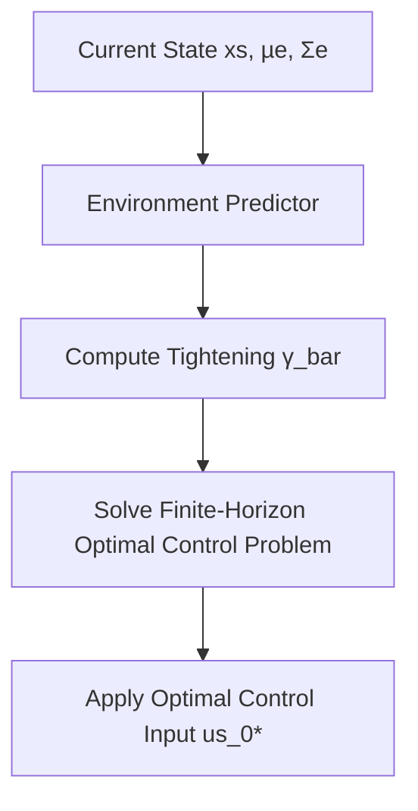

<!-- _class: lead -->

# Perception-Aware Chance-Constrained Model Predictive Control (PAC-MPC)
## Integrating control decisions and action-dependent perception uncertainty for constrained autonomous operation

Angelo Domenico Bonzanini, Ali Mesbah, Stefano Di Cairano · September 2026

---

# Introduction & Motivation

- Autonomous systems operate in uncertain, dynamic environments requiring active perception via sensors.
- Traditional MPC assumes perception is independent of control, neglecting physical sensing limits like field-of-view and range.
- Perception quality directly depends on control actions such as motion trajectory, sensor orientation, and beamforming.
- PAC-MPC closes the loop between control actions and perception uncertainty to achieve less conservative trajectories.


*Interdependence between control actions, perception uncertainty, and constraint tightness.*


<!--
Autonomous navigation requires decision-making under environmental uncertainty.
Standard MPC frameworks treat state estimation quality as independent of control
inputs. In contrast, PAC-MPC recognizes that how a robot moves directly governs
what its sensors see, creating a bidirectional coupling between control
decisions and state estimation quality.
-->

---

# System, Environment & Estimator Modeling

- Known deterministic system dynamics: xs_{k+1} = fs(xs_k, us_k) subject to admissible sets X and U.
- Dynamic environment state: xe_{k+1} = fe(xe_k, ψ_k) modeling stationary obstacles or moving agents.
- Action-dependent measurements: ye_k = qe(xe_k, ζ_k, xs_k, us_k) dependent on system state and inputs.
- Fixed estimator provides mean µe and covariance Σe updates driven by system states and control actions.

| Model Component | Variable / State | Governing Equation | Key Characteristics |
| --- | --- | --- | --- |
| System Model | xs ∈ R^nx, us ∈ R^nu | xs_{k+1} = fs(xs_k, us_k) | Known deterministic dynamics |
| Environment Model | xe ∈ R^mx | xe_{k+1} = fe(xe_k, ψ_k) | Exogenous obstacles/boundaries |
| Sensor Measurement | ye ∈ R^my | ye_k = qe(xe_k, ζ_k, xs_k, us_k) | State & input dependent noise |
| Estimator Dynamics | µe ∈ R^mx, Σe ∈ R^{mx×mx} | Σe_{k+1} = g_Σ(Σe_k, xs_k, us_k) | Covariance coupled to control |

*Mathematical models defining system, environment, and estimator interactions in PAC-MPC.*


<!--
The mathematical framework decouples known system motion dynamics from exogenous
environment dynamics. Although the estimator itself is fixed within onboard
sensor hardware, its state estimation covariance remains controllable via the
system's trajectories and sensor inputs.
-->

---

# Perception-Aware Chance Constraints Formulation

- Safety constraints enforced as Individual Chance Constraints (ICCs): P[hs_l xs + he_l xe ≤ hb_l] ≥ 1 - ε_l.
- Deterministic reformulation converts chance constraints into tightened bounds via backoff parameter γ_bar(Σ^e).
- Environment Predictor computes predicted mean µ^e and covariance Σ^e using measurement prediction error Σy.
- PAC-MPC optimizes augmented state ξ = (xs, Σe) to stabilize tracking error while managing perception uncertainty.


*Optimization pipeline for PAC-MPC with environment predictor and constraint backoff.*


<!--
To ensure probabilistic collision avoidance, individual chance constraints are
transformed into deterministic tightened linear constraints. The tightening
backoff depends directly on predicted estimation covariance, giving the
optimization problem an explicit incentive to plan maneuvers that reduce sensor
uncertainty.
-->

---

# Recursive Feasibility & Closed-Loop Stability

- Predictor Monotonicity (Assumptions 3 & 4): Ensures prediction bounds do not underestimate constraint tightening.
- Terminal Set Invariance: Parametrized terminal set Z_f(Me) guarantees recursive feasibility in probability.
- Joint Cost Function: Merges control performance stage/terminal costs with perception stage/terminal costs.
- Lyapunov Stability: Guarantees asymptotic stability in probability for joint system state and estimation covariance ξ.


<!--
Establishing stability for perception-aware control requires analyzing closed-
loop feedback between sensing and actuation. Under mild monotonicity properties
on the environment predictor, recursive feasibility is maintained with
probability at least the product of single-step constraint satisfaction bounds.
-->

---

<!-- _class: divider -->

# Constructive Design Procedure for Linear Dynamics

---

# Constructive Design Procedure for Linear Dynamics

- Applies to linear system dynamics (As, Bs), linear estimator Λ, and polyhedral constraint sets.
- Terminal Controller: Linear feedback u = K_f xs + G_f r constructs Maximum Constrained Admissible Set (MCAS) O_∞.
- Perception Stage & Terminal Costs: Formulated via squared Frobenius norms of covariance error over horizon N_p.
- LMI Optimization: Terminal cost weight Pc and compensation matrix M_c designed iteratively via LMIs.

```python
import numpy as np

def compute_pac_mpc_cost(xs, us, Sigma_e, rx, ru, Sigma_r, Qc, Rc, Sc, Pc, Wc, N_p, Lambda):
    # Control stage cost
    cost_control = (xs - rx).T @ Qc @ (xs - rx) + (us - ru).T @ Rc @ (us - ru)
    # Perception stage cost
    dSigma = Sigma_e - Sigma_r
    cost_perception = Sc * (np.linalg.norm(dSigma, 'fro')**2)
    # Terminal perception cost over horizon N_p
    term_perception = 0.0
    for h in range(N_p):
        Lambda_h = np.linalg.matrix_power(Lambda, h)
        term_perception += np.linalg.norm(Lambda_h @ dSigma @ Lambda_h.T, 'fro')**2
    return cost_control + cost_perception + Wc * term_perception
```
*Python implementation snippet for PAC-MPC stage and terminal cost calculation.*


<!--
For linear system settings, theoretical conditions simplify into a constructive
procedure. The terminal set is synthesized as a Maximum Constrained Admissible
Set parametrized by tightening margins, and Lyapunov stability conditions reduce
to solvable Linear Matrix Inequalities.
-->

---

# Case Study & Numerical Results

- Evaluated on benchmark double integrator system with input-dependent and state-dependent sensor quality.
- Closed-loop trajectories successfully regulate system state to setpoint while satisfying chance constraints.
- Monte Carlo Validation: 100 runs over 200 time steps yielded 98% empirical constraint satisfaction (exceeding 95% target).
- Real-Time Performance: Average solver execution time of 22 ms per step (worst-case < 30 ms) using IPOPT in CasADi.

| Parameter / Performance Metric | Value / Configuration |
| --- | --- |
| System Benchmark Model | Double Integrator (Sampling time Ts = 1 s) |
| Chance Constraint Threshold | 1 - ε = 0.95 (95% safety bound) |
| Empirical Constraint Satisfaction | 98% (across 100 Monte Carlo runs) |
| Average Solvetime per Step | 22 ms (IPOPT via CasADi on Mac Laptop) |

*Case study simulation parameters and performance statistics.*


<!--
Numerical simulations on a double integrator highlight the practical advantages
of PAC-MPC. The controller actively maneuvers to improve sensor perception when
approaching workspace boundaries, exceeding empirical safety targets while
comfortably meeting real-time control frequency demands.
-->

---

# Conclusions & Future Outlook

- PAC-MPC establishes a systematic methodology unifying perception uncertainty with predictive control decision-making.
- Guarantees recursive feasibility and closed-loop probabilistic stability for autonomous systems in unknown environments.
- Significantly reduces trajectory conservatism compared to passive estimation baselines.
- Future Work: Integration with learned neural perception models, specialized SQP solvers, and experimental testbeds.


<!--
PAC-MPC resolves the conservatism of passive perception by embedding active
sensing goals directly into the predictive controller. Future directions focus
on integrating machine-learned perception pipelines and testing the controller
on physical autonomous vehicles.
-->

---

<!-- _class: divider -->

# Key Takeaways

- Active Coupling: Controlling system motion directly influences perception quality and constraint tightness.
- Rigorous Safety: Guarantees recursive feasibility and closed-loop stability under probabilistic individual chance constraints.
- Real-Time Viability: Demonstrates 98% empirical safety and sub-30ms computation times for real-time robotic deployment.

**Keywords:** Model Predictive Control, Perception-Aware Control, Chance Constraints, Autonomous Vehicles, Uncertain Environments

---

<!-- _class: lead -->

# Thank You

Questions & Discussion
